# ETL - Glue

AWS Glue is an extract, transform and load (ETL) service. It is serverless, like Lambda, this allows the user to perform tasks without managing instances. 

It is also infers schema form semi-structured (JSON) and structured datasets via its use of crawlers

A crawler connects to a data store and determines the schema for the data. Following this, the meta data will be saved to a data catalog which will articulate the schema of the data. This can be used in Glue to transform the data and load to another data store.

In this project, we will build upon the Watch Scrape project and transform the data in our S3 bucket and load to an output S3 bucket. Find the file here: [Lambda Function](../Watch-Scrape/lambda_function.py)

#

## Steps

1. Create S3 Buckets

Here, we will create the input, output and script buckets.

The __input__ bucket will be the destination for the `.json` file from our lambda function and the __output__ bucket will be the destination for the csv we'll create as a result of the Glue Job.

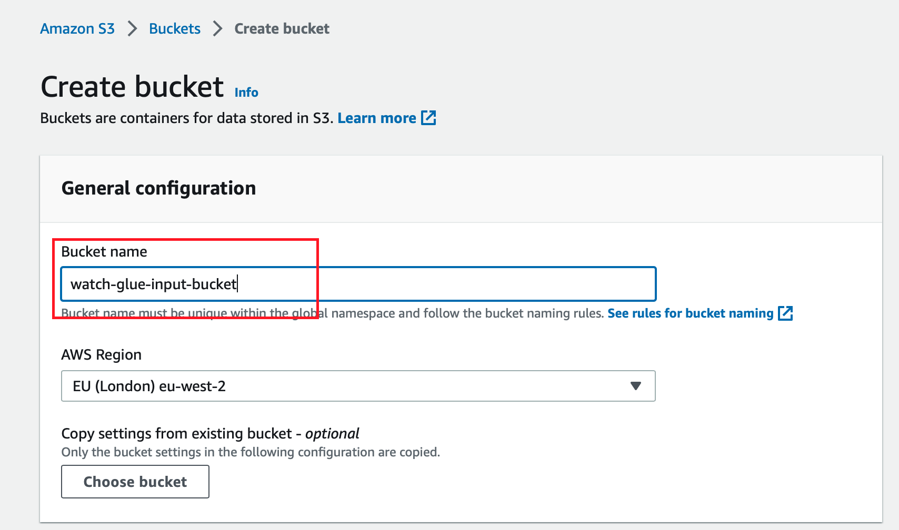

2. Create New IAM Role for Glue

Here, we want to create a role for Glue that will allow us to access the data in the S3 bucket and also write to an S3 bucket

Navigate to the IAM dashboard and locate roles under Access Management. 

Once you hit Create Role, search for _Glue_ and select the permission

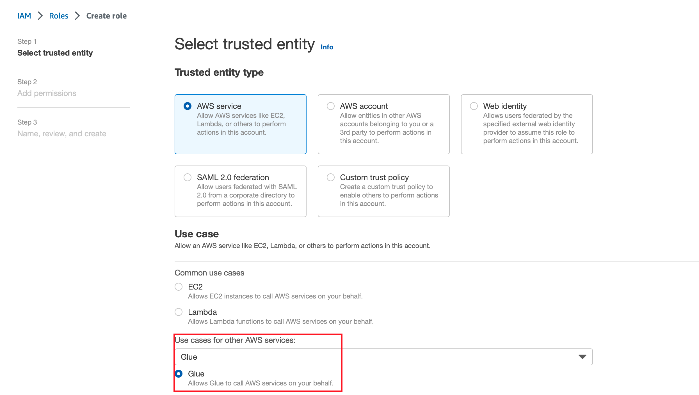

Following that, give this new role the __PowerUserAccess__ policy

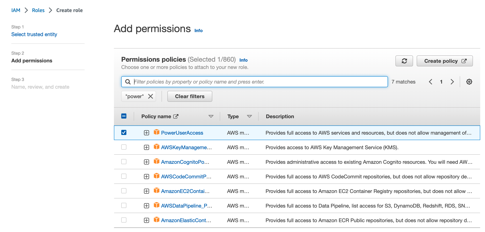

3. Create Database and Crawler In Glue

Finally, we can start configuring our Glue playground. We first need to create a database. This database will hold the meta data for our schema inference once our input data is crawled. 

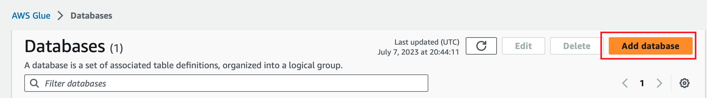

Give the database a name then move onto creating the crawler

This crawler will look in the input data store and infer the schema of the data to store in the database we previously created. 

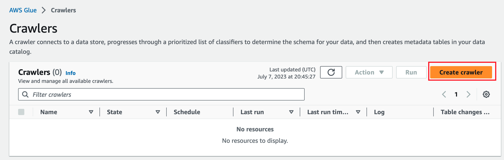

Once you give the crawler a name, you'll need to add a data source

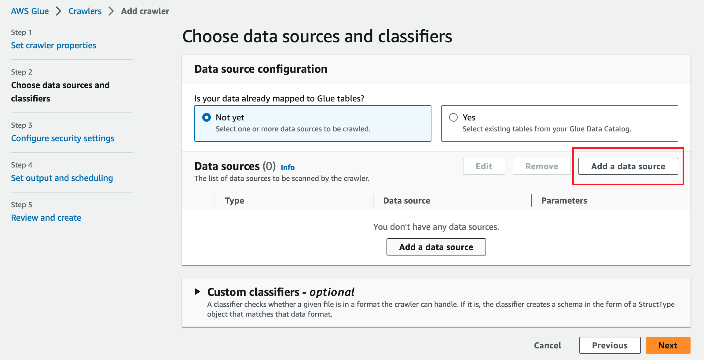

Navigate to _Browse S3_ and locate the input bucket

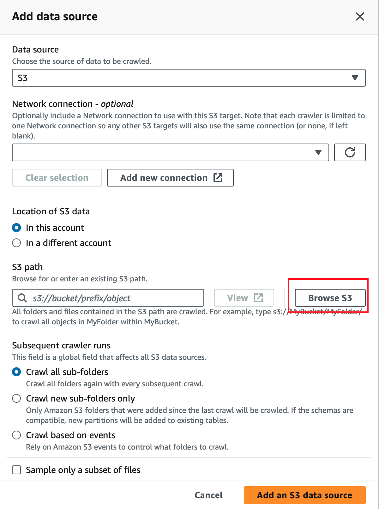

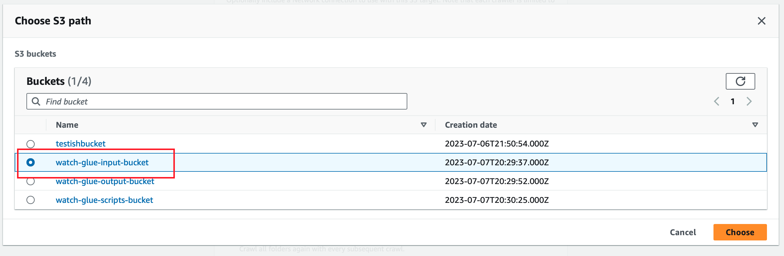

Once you've chosen the Input bucket for the crawler, you'll need to add a trailing slash

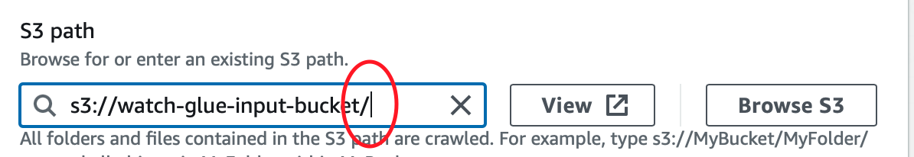

Hit _Add an S3 Data Source_ and move onto configuring the security settings

Choose the appropriate role, the PowerRole we created earlier 

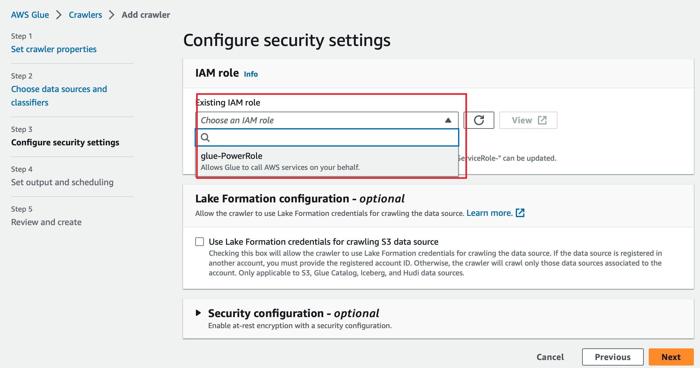

Finally, the target database should be the database we created earlier. 

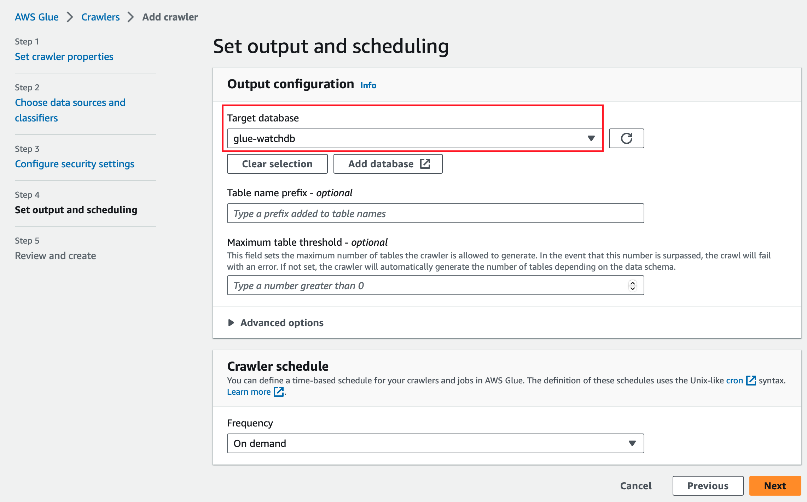

Now, we are almost ready to crawl our input bucket. We need to make sure we have data in our input bucket. Make sure the Lambda function is pointing to the new input bucket we created; in my case, this would be _watch-glue-input-bucket_.

Once you are sure the Input bucket has the correct information, run the crawler

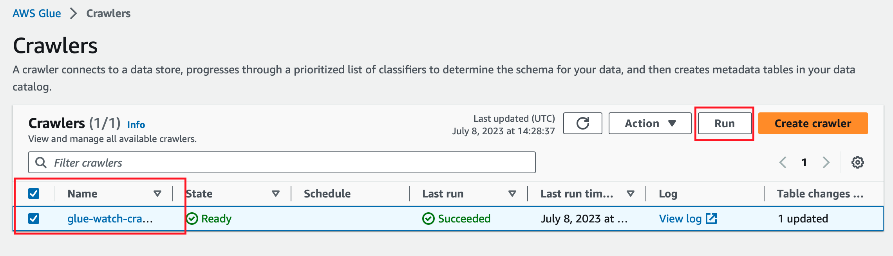

Once the Crawler has finished, we can verify it was successful by navigating to the table under the database we created.

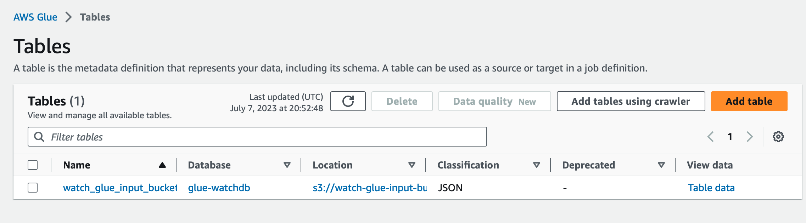

You might need to hit refresh to see the new table

Click the table and you'll be taken to the Table Overview, where you should see the Schema inferred from the .json file in our input bucket.

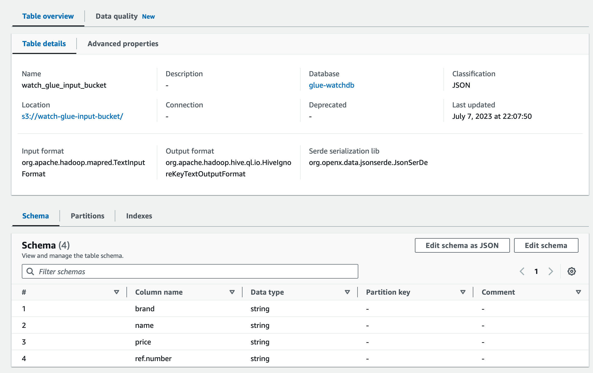

4. Create Glue Job

We can finally create our Glue Job to perform our ETL process. Navigate to _Visual ETL_.

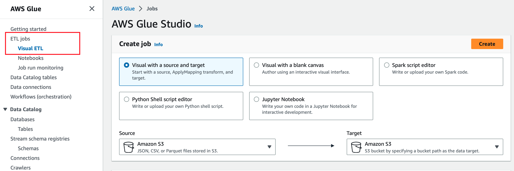

You can see that Glue give you options on how to create your job. We can set our source and target here and be given a visual template of our process.

We'll select Data Catalog Source and S3 Bucket Target

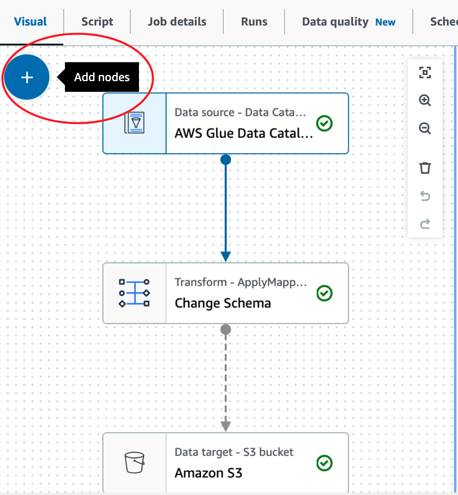

You can add nodes to if you want to do further transformations or add a different target source. 

5. Configure Job Settings

Here, we will configure each node to collect the correct data, transform it and load it to the appropriate S3 Bucket. First, we'll start with the Data Catalog

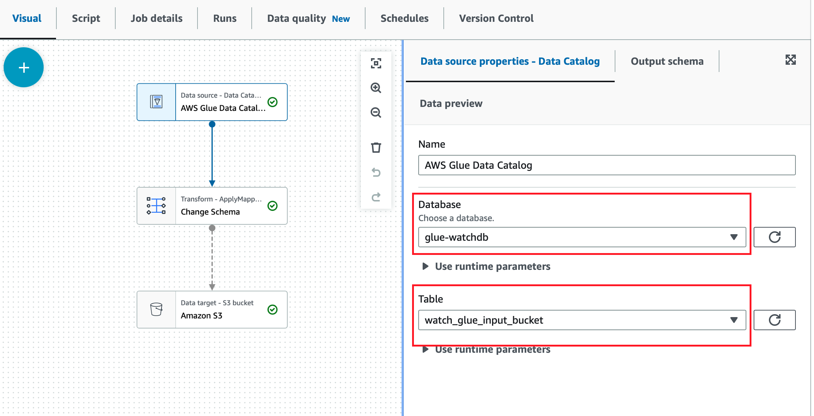

We chose our database we created earlier with our new table output from our Crawler.

Next, we'll configure our Transform node.

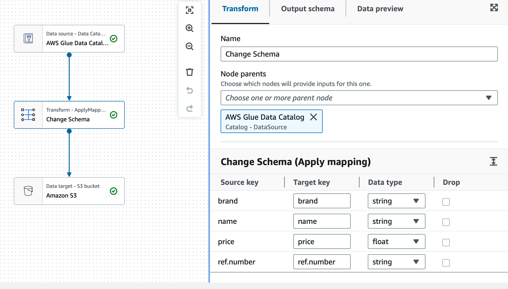

I chose to change our price column from a _string_ to a _float_ to be more appropriate.

Finally, we'll configure our Load/Target node.

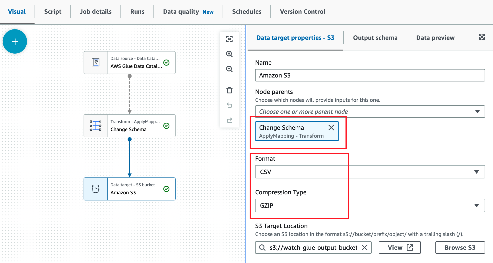

I want the node to pick up the changes made by the Transform node and then output a CSV file to the output bucket. Remember to add a trailing slash after the Target Location path.

We need to edit our Job Details also, navigate to _Job details_ in the ribbon above. Give the Job a name and amend the the IAM Role with the PowerRole that was created. Yo can also amend the _Advanced properties_ to have the Script path be the script bucket we created at the start. 

Once all of that is done, we can save and run our Job. We can check the status of our job by navigating to _Job run monitoring_

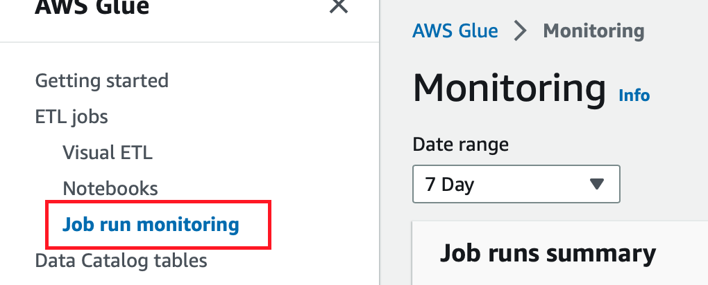

Once our job has succeeded, we can go to our S3 output Bucket and download our __compressed__ file. 

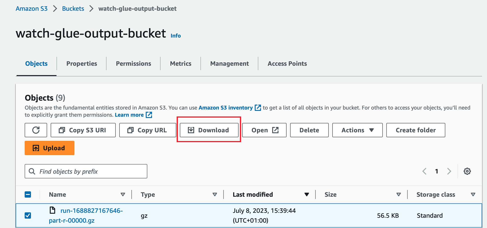

Once downloaded, we can change the file extension to `.csv` and open the file to view the contents!

## Challenges

1. The main challenge was dealing with the output `.json` file from Lambda. I had to configure the Lambda function to output the `.json` file in the correct format. 

