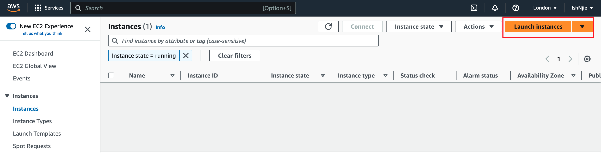
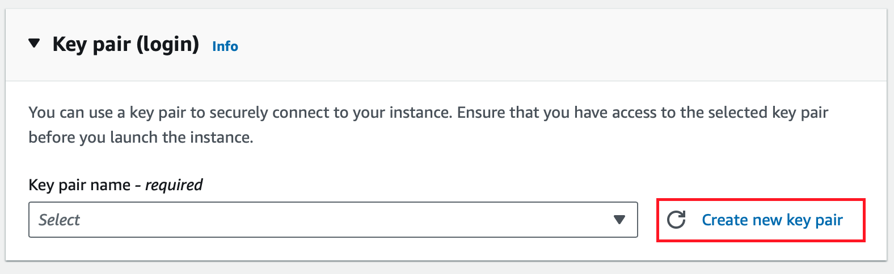
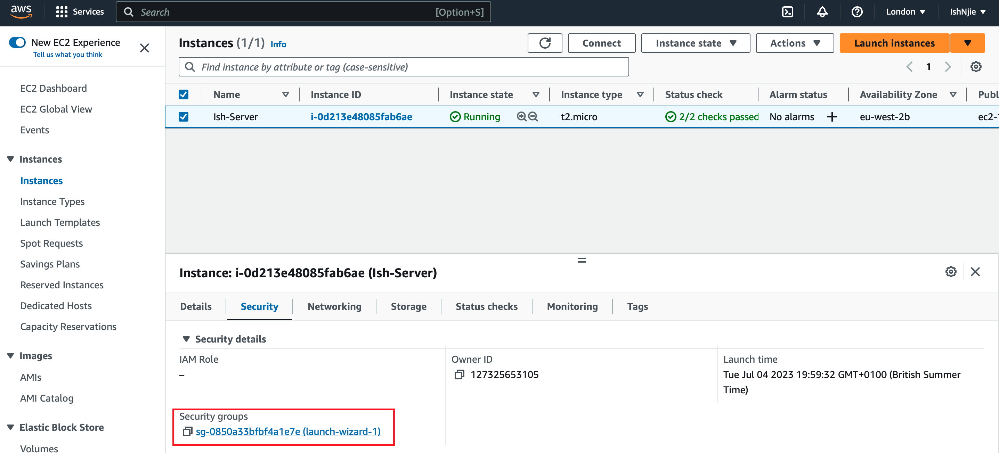
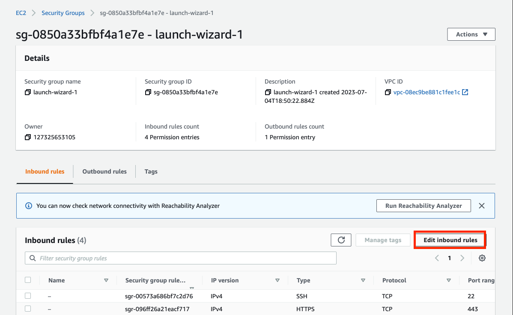
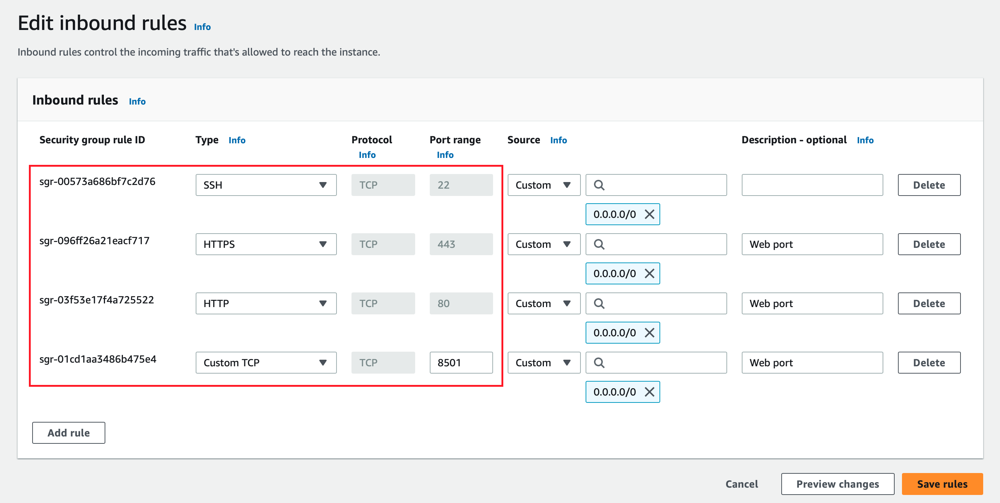
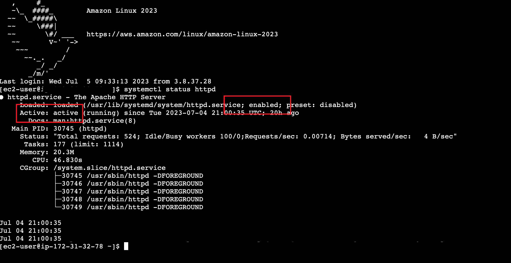
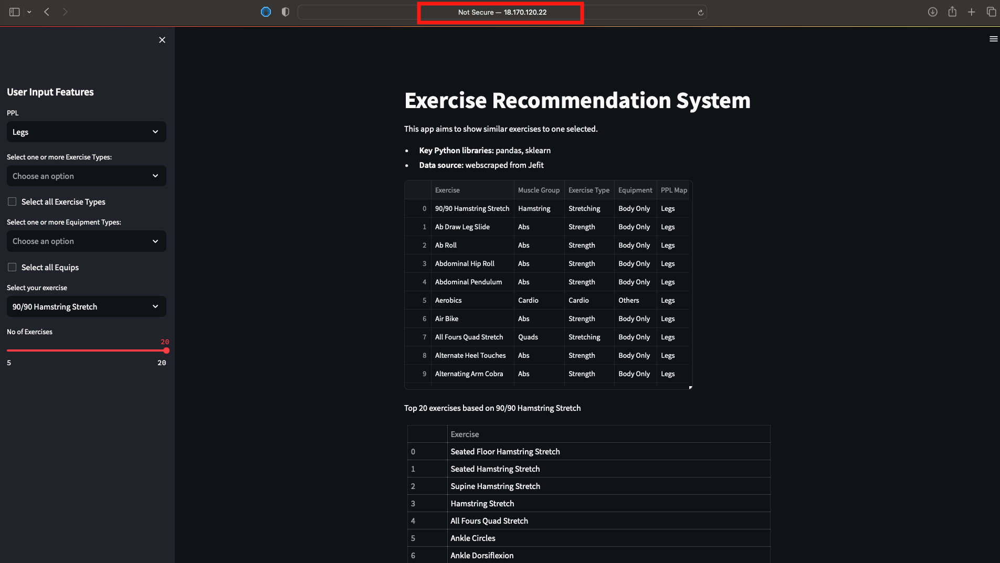

# Streamlit Host - EC2


Amazon EC2 (Elastic Compute Cloud) is a web service that offers resizable compute capacity (Virtual Machines) in the cloud. 

In this project, we will configure an AWS EC2 Instance to host our Streamlit app. Our Streamlit app is one that allows users to receive recommendations for gym exercises. I have a separate repo for this app [here](https://github.com/IshNjie/Exercise_Recommender)

I chose to explore this as Streamlit has its own community cloud to host apps, however, if I wanted to keep the data private from the community cloud, I'd have to build a dedicated server to host the data and the app. 

#

## Steps

1. Create Account and navigate to `EC2` via the services dashboard. 

2. Launch Instances



3. Configure Instances

Default: Linux OS

Create Key pair: Allows to connect to instances securely; chose RSA type by default and .pem file



(.pem) certificate will be downloaded onto local machine. This will be used to interact with the server instance. Do not forget the location of the .pem file


4. Connect via EC2 Instance Connect 

For the server, a web server would need to be installed on the EC2 instance in order to communicate with the web. Python and pip will also need to be installed on the machine so that the app can run:

```
sudo yum install -y httpd

sudo yum install python3

sudo yum install python3-pip

```

5. Copy folder from local directory to EC2 Instance

The folder I aim to copy over into our EC2 instance will contain the `app.py` file, the data folder and the requirements.txt file for installing into our virtual environment once our instance is fully set up

```
sudo scp -i /path/to/.pem -r folder/ ec2-user@IP-Address:
```

the `scp` command is used to copy files from local to a remote system.

The `-i` is used identify the .pem file as a secure file, used for authentication

The IP-Address used should be the public IP or DNS provided on the server details

By default, the folder copied will be in the `home` directory if no directory is defined after the `:`

5. Configure Inbound Rules

In Amazon EC2, inbound rules refer to the configuration settings that control incoming network traffic to your EC2 instances. These rules define which protocols, ports, and sources are allowed to access your instances.



Next, locate `Edit Inbound rules`



Then configure new rules

- New rules for HTTP and HTTPS
- New rules for Custom TCP at port 8501 for Streamlit



6. Enable and start httpd server instance 

Back to the terminal, we need to enable and start the httpd server we installed

```
systemctl enable httpd
systemctl start httpd
```

After that, use the command `systemctl status httpd` to see if the server is running



Here we are looking for `enable` and `active (running)`


## App

Once we are done with the dependencies and setting up our instance, we can run a virtual environment for our python packages. 

```
python3 -m venv venv

source venv/bin/activate
```
We can install the Python packages we need, such as pandas, sklearn and more importantly, Streamlit.

Follwoing that, to start the Streamlit app, use the following command:

```
streamlit run app.py
```

This will start the app on the EC2 instance. Navigate to the External URL given in the terminal and your app should be set up.
http://18.170.120.22:8501

 

## Challenges

Some Challenges included:

1. Copying over the folder, I have to familiarize myself more with Linux commands. 
2. Configuring the Inbound Rules, I assumed HTTP and HTTPS rules were enough, but I had to configure a custom rule for the port 8501