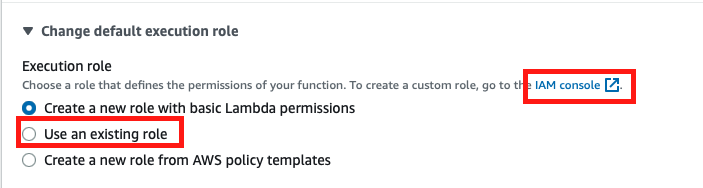
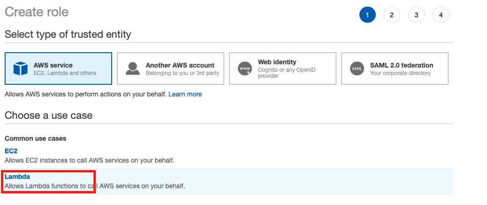
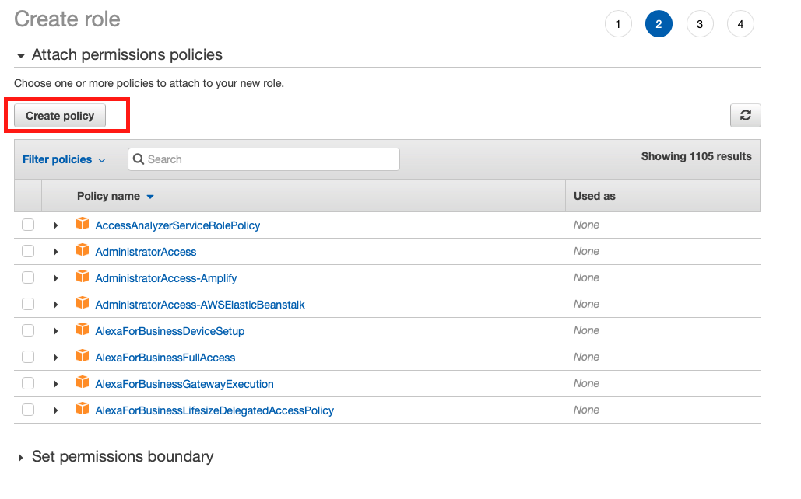
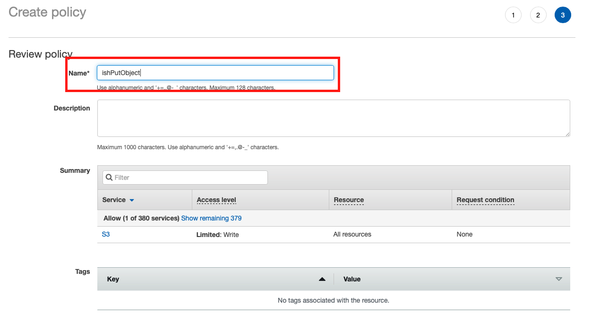
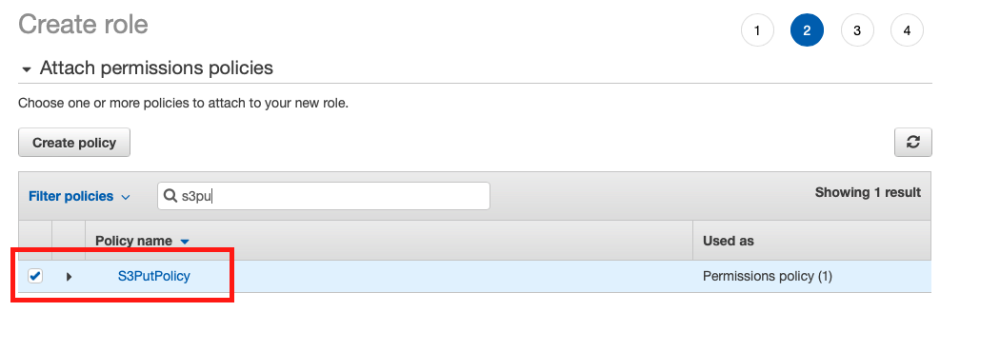
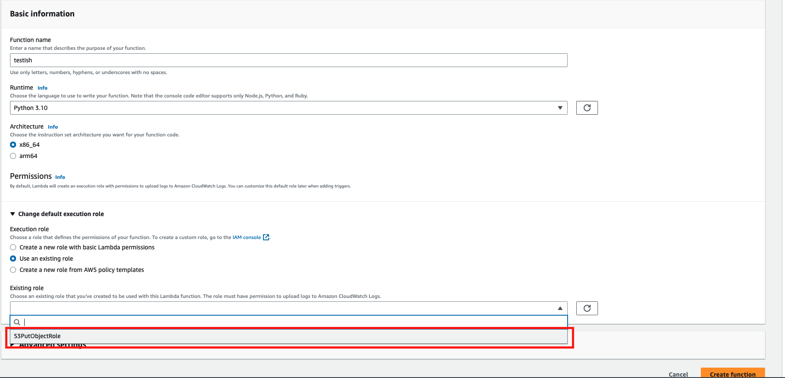
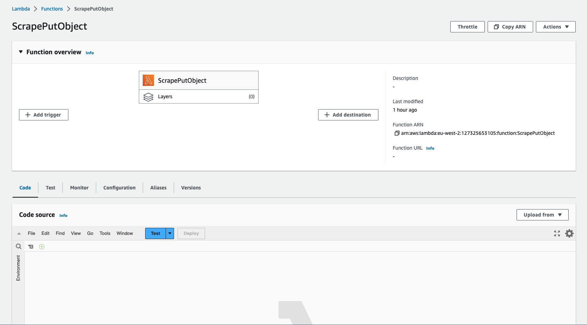

# Web Scrape - Lambda & S3

AWS S3 stands for Amazon Simple Storage Service. It is a storage service that permits the storage for large sums of data, of varying formats. Azure Blob Storage would be it's counterpart in the Microsoft world. 

S3 consists of buckets and objects. Buckets are a container to store data within; the objects would be the data you store within the buckets.

AWS Lambda is a serverless compute service. This allows the user to run code without managing servers/VMs (EC2 for example). Lambda supports a whole host of languages.

In this project, we will configure a Lambda function to scrape a website with watch prices and load that into an S3 bucket.

#

## Steps

1. Create Account and navigate to `S3` via the services dashboard. 

2. Create bucket

This step is pretty straight forward and I kept the default settings for the bucket configuration

3. Navigate to `Lambda` via the services dashboard and create a Lambda Function

4. Create a new role

This role will need to have policies that allow the function to write to an S3 bucket.

Head to the IAM Console to start this process

5. Choose Service for Role to interact with (use case)

6. Create a new policy

The reason we create a new policy here is so that we can configure write access to the S3 bucket

Then we name our new policy and `Create Policy`

7. Head back to create Role and select the new policy just set up

Follow through, give the Role a name and `Create Role`

8. Head back to our Lambda Function and add the new existing role

You might need to refresh the list for it to show up

Also, do not forget to configure the Runtime to the language of your choice

9. `Create Function` and visit the UI

